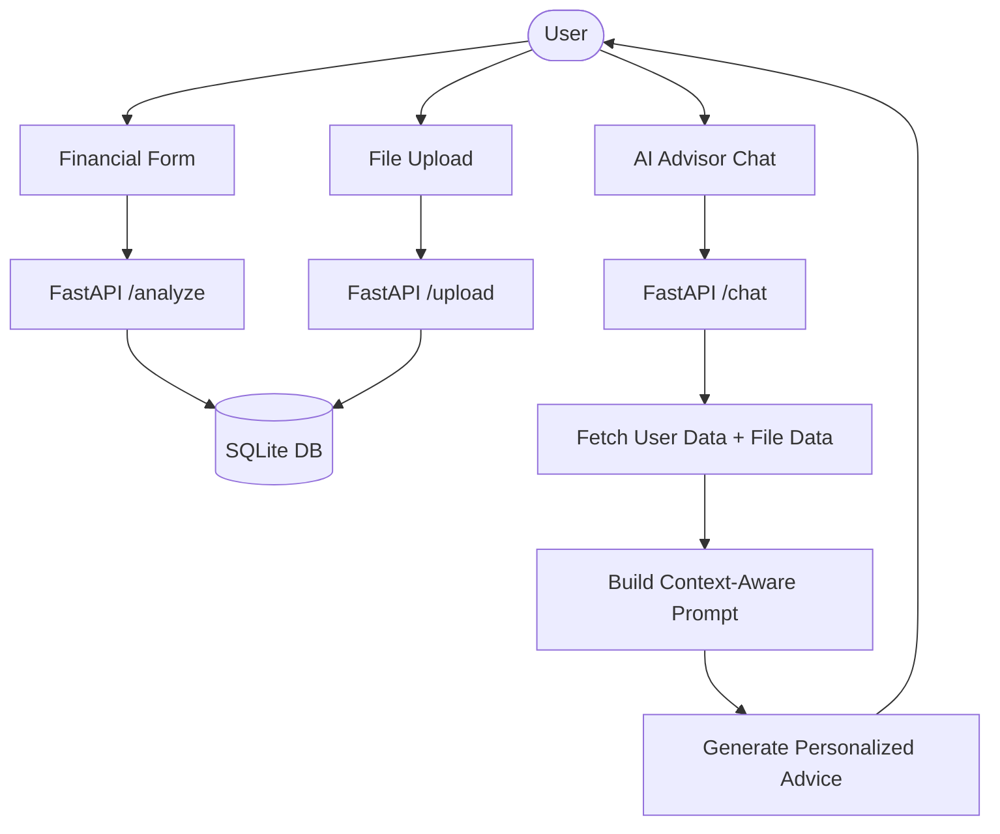

# 🚀 FinWise AI — Personalized Financial Intelligence

[](https://nextjs.org/)
[](https://fastapi.tiangolo.com/)
[](https://sqlmodel.tiangolo.com/)
[](https://tailwindcss.com/)

**FinWise AI** is a production-grade, local financial intelligence system designed to help users achieve clarity and control over their money. By combining a modern **Next.js** frontend with a high-performance **FastAPI** backend and a **persistent database**, FinWise AI offers personalized budgeting, spending analysis, and context-aware AI guidance.

---

## 🎯 Problem Statement
Most personal finance apps are either too manual (spreadsheets) or too generic (basic charts). Users often end the month wondering where their money went, despite having the data. Traditional AI chatbots are stateless—they forget your income, your goals, and your past spending, leading to repetitive and frustrating interactions.

## 💡 Solution: FinWise AI
FinWise AI bridges the gap between raw data and actionable wisdom. It treats your financial profile as a persistent context, allowing the AI to act as a "Financial Strategy Partner" that remembers your history, understands your documents, and gives advice tailored specifically to your life.

---

## 🧠 Key Features

### 1. **AI Financial Strategist (Context-Aware)**
*   **Persistent Memory:** The AI fetches your latest profile from the database. No more re-entering your income every time you chat.
*   **Deep Context:** Automatically incorporates your spending categories and uploaded document data into every response.
*   **Premium UI:** A minimal, dark-themed chat interface with a collapsible sidebar and auto-expanding input.

### 2. **Smart Financial Profiling**
*   **Unified Data Entry:** A sleek form to capture income, fixed expenses, and categorical spending (Food, Travel, etc.).
*   **Persistent Storage:** Data is stored in a SQLite database, ensuring it's available across the Dashboard and AI Advisor.

### 3. **Intelligent Financial Dashboard**
*   **Health Score:** A dynamic "Money Health Score" calculated based on your savings ratio.
*   **Categorical Breakdown:** Visual representation of where every rupee goes.
*   **Automated Insights:** Instant detection of overspending in specific lifestyle categories.

### 4. **Multi-Agent Architecture**
The system is designed with specialized logical layers (Agents):
*   **Analyzer Agent:** Processes raw numbers into ratios and insights.
*   **Document Agent:** (Mocked) Handles file parsing and data extraction.
*   **Advisory Agent:** Generates personalized, rule-based responses for the chat.

---

## 🏗️ Architecture & Workflow

### **System Workflow**


### **Tech Stack**
*   **Frontend:** Next.js 15 (App Router), TypeScript, Tailwind CSS, Lucide React.
*   **Backend:** FastAPI (Python 3.10+), SQLModel (ORM), Pydantic.
*   **Database:** SQLite (Persistent local storage).
*   **AI Logic:** Structured context-building with rule-based reasoning (ready for LLM integration).

---

## 🧩 AI Agents Breakdown
| Agent | Responsibility | Implementation |
| :--- | :--- | :--- |
| **Ingestion Agent** | Validates and sanitizes user input from forms. | Pydantic Models |
| **Analyzer Agent** | Calculates savings rates, detected leaks, and spending ratios. | `analyze_finance` Logic |
| **Memory Agent** | Manages persistence between the session and the DB. | SQLModel / SQLAlchemy |
| **Advisor Agent** | Synthesizes context + query into actionable advice. | Context-Aware Chat Prompt |

---

## 📁 Project Structure
```bash
FinWise-AI/
├── backend/
│   ├── app/
│   │   ├── routes/
│   │   │   └── analyze.py    # Core API Endpoints (Analyze, Chat, Upload)
│   │   ├── models.py         # DB Schema (User, FinancialData, etc.)
│   │   └── main.py           # FastAPI Entry Point
│   └── finwise.db            # Persistent SQLite Database
├── frontend/
│   ├── app/
│   │   ├── ai-advisor/       # Redesigned Premium Chat UI
│   │   ├── dashboard/        # Financial Overview & Score
│   │   ├── form/             # Data Ingestion Form
│   │   └── layout.tsx        # Global Styles & Navbar
│   ├── components/
│   │   └── chat/             # Modular Chat Components
│   └── public/               # Static Assets
└── README.md
```

---

## 🛠️ Installation & Setup

### **Backend Setup**
1. Navigate to the backend folder:
   ```bash
   cd backend
   ```
2. Install dependencies:
   ```bash
   pip install -r requirements.txt
   pip install sqlalchemy sqlmodel pydantic-settings
   ```
3. Run the server:
   ```bash
   python -m app.main
   ```

### **Frontend Setup**
1. Navigate to the frontend folder:
   ```bash
   cd frontend
   ```
2. Install dependencies:
   ```bash
   npm install
   ```
3. Start the development server:
   ```bash
   npm run dev
   ```

---

## 🔐 Environment Variables
Create a `.env.local` in the `frontend` directory:
```env
NEXT_PUBLIC_BACKEND_URL=http://localhost:8000
```

---

## 📌 Future Improvements
*   **RAG Integration:** Use `pgvector` to store and query document chunks for real PDF analysis.
*   **Ollama Integration:** Connect the context-aware prompt to a local Llama 3 or Mistral model.
*   **Authentication:** Add Clerk or NextAuth for multi-user support.
*   **FIRE Calculator:** Dedicated agent for Financial Independence / Retire Early projections.

---

## 📜 License
This project is licensed under the MIT License - see the [LICENSE](LICENSE) file for details.

---
*Built with ❤️ for Financial Clarity.*
